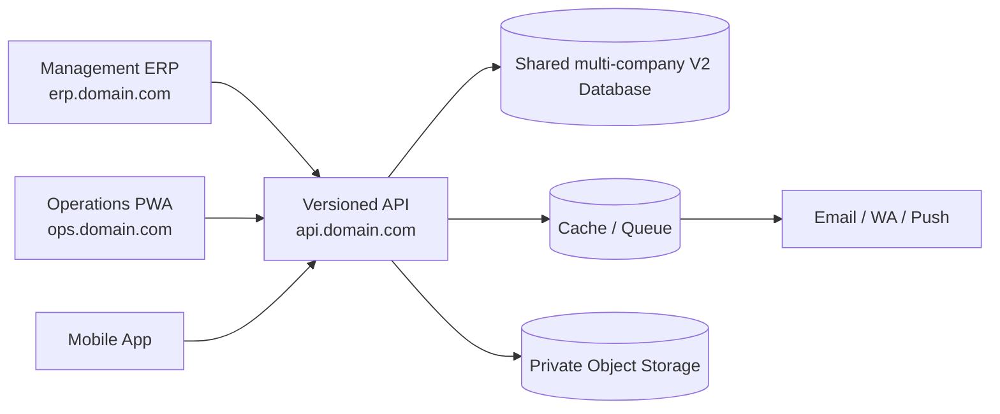

# Target Architecture

## 1. Context



Semua client memakai API yang sama. ERP boleh memiliki aggregation endpoint, tetapi tidak boleh membaca database secara langsung.

## 2. Backend style

Modular monolith dipilih untuk menjaga transaction consistency dan delivery sederhana sambil tetap memaksa boundary domain.

```text
Modules/
  Identity
  Approval
  Procurement
  Finance
  Inventory
  Fleet
  Pickup
  Service
  Support
Shared/
  Audit
  Files
  Notifications
  Observability
```

Setiap module memiliki Http, Actions, DTOs, Models, Policies, Services, Events, dan Tests sendiri.

## 3. Boundary rules

- Satu model canonical per entity/table.
- Domain hanya menulis tabel miliknya.
- Cross-domain synchronous call melalui interface/application service.
- Side effect eksternal melalui transactional outbox.
- Tidak ada business logic di route, controller, observer, atau Blade/SPA.
- Controller tipis: authorize, validate, dispatch, respond.
- Read model khusus diperbolehkan untuk dashboard/report.
- Status transition dikelola action/state machine.
- Uang disimpan decimal/integer minor unit sesuai keputusan finance, tidak memakai float.

## 4. Data strategy

- V2 memiliki schema baru.
- Satu database operasional melayani dua legal entity dengan `company_id` wajib pada seluruh aggregate bisnis.
- PT Rajawali Kreatif Sentosa dan PT Rajawali Kreatif Sinergi memiliki numbering, approval, account, balance, serta report scope masing-masing.
- Foreign key/constraint dan policy mencegah referensi silang company; pemilihan company dari client tidak pernah dipercaya tanpa authorization.
- Consolidated financial reporting bukan scope awal walaupun schema mendukung isolasi multi-company.
- Legacy tidak menjadi dependency runtime permanen.
- Data masuk melalui staging/import pipeline.
- `legacy_id`/mapping dipertahankan untuk traceability.
- Setelah import diterima, hanya V2 menjadi system of record.
- Histori yang tidak diimpor disimpan sebagai encrypted archive, bukan aplikasi aktif.

## 5. Authentication

- Rilis awal memakai identity lokal karena belum ada akun korporat atau identity provider terpusat.
- Web first-party: secure session cookie/CSRF melalui API auth layer.
- Mobile: rotating device-bound token untuk MVP.
- Boundary authentication tetap OIDC-ready; jika identity provider korporat tersedia, web/mobile beralih ke Authorization Code + PKCE tanpa mengubah RBAC domain.
- MFA wajib untuk platform/security admin dan role finance berisiko tinggi.
- Authorization menggunakan Policy + permission + assignment scope.
- UI hanya menyembunyikan affordance; API tetap menjadi enforcement point.

## 6. API architecture

- Prefix `/api/v1`.
- OpenAPI adalah contract source of truth.
- Generated typed client untuk web/mobile bila tooling mendukung.
- Consistent error envelope, pagination, filtering, and request ID.
- `Idempotency-Key` untuk payment, stock, approval, pickup resolution, dan offline mutation.
- Optimistic version/ETag untuk edit yang rawan conflict.

## 7. Reliability

- DB transaction membungkus perubahan state internal.
- Provider eksternal tidak dipanggil di tengah transaction.
- Outbox worker memiliki retry, backoff, dead-letter handling.
- Scheduler/worker berjalan sebagai process terpisah.
- Health endpoint membedakan liveness dan readiness.
- Backup otomatis dan restore rehearsal terjadwal.

## 8. Deployment units

```text
api                One deployable backend
api-worker         Queue/outbox worker
api-scheduler      Scheduled commands
erp-web            Static/SSR frontend deployment
ops-web            PWA frontend deployment
mobile             App store/internal distribution
```

Subdomain bukan microservice boundary. Service baru hanya diekstrak jika ada kebutuhan independent scaling, ownership team, release isolation, atau availability yang terbukti.

## 9. Repository guardrails

- CI melarang failing migration/test/lint/security scan.
- Architecture test melarang import model lintas module yang tidak diizinkan.
- Secret scanning dan dependency audit wajib.
- Production artifact hanya memuat source/build yang diperlukan.
- Tidak ada dump, log, session, attachment, atau `.env` di artifact.

## 10. Technology baseline

| Layer | Keputusan P0 |
|---|---|
| Backend/API | Laravel 13 pada PHP 8.5, modular monolith |
| Database | PostgreSQL 18, satu schema operasional multi-company |
| Cache/queue | Redis |
| ERP/OPS web | React 19 + TypeScript + Vite, aplikasi terpisah dengan shared UI/typed API client |
| Mobile | Flutter 3.44, dimulai setelah Operations API stabil |
| File | Private S3-compatible object storage |
| Contract | OpenAPI 3.1 sebagai source of truth API |
| Local environment | Containerized dependencies dan repeatable setup |

Major version dikunci per release train dan patch/security update diterapkan rutin. Upgrade major tidak dilakukan otomatis tanpa compatibility test.
