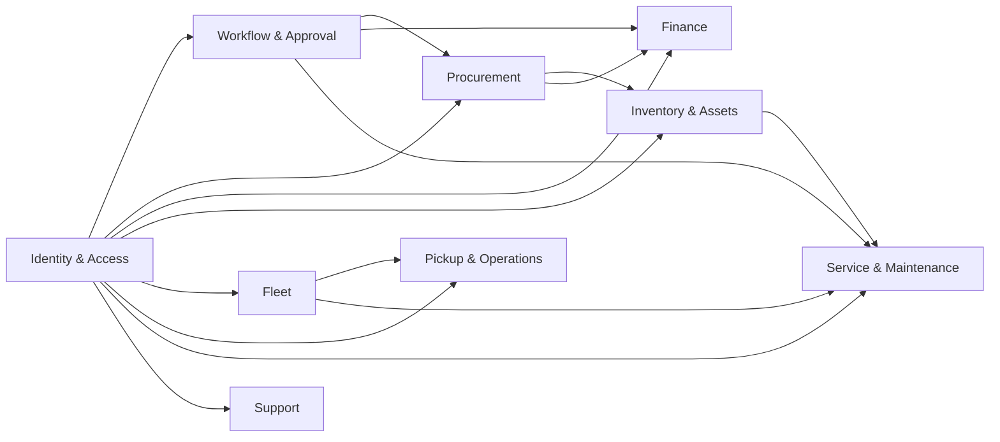
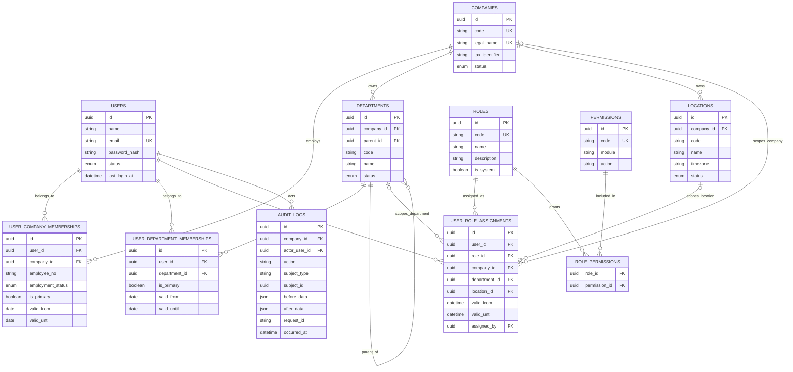
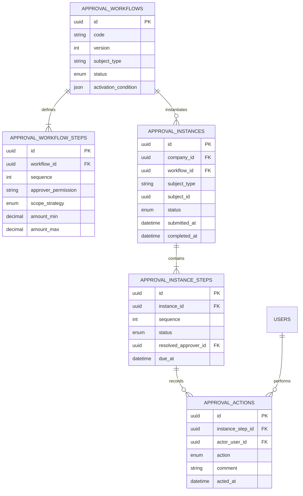
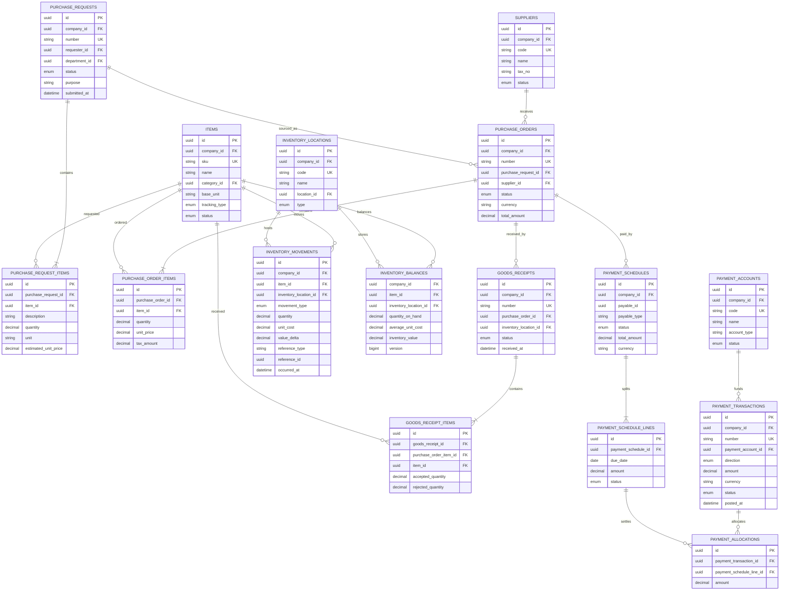
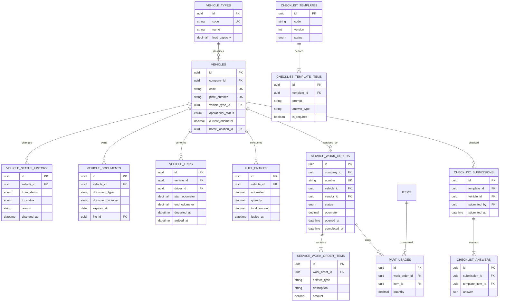
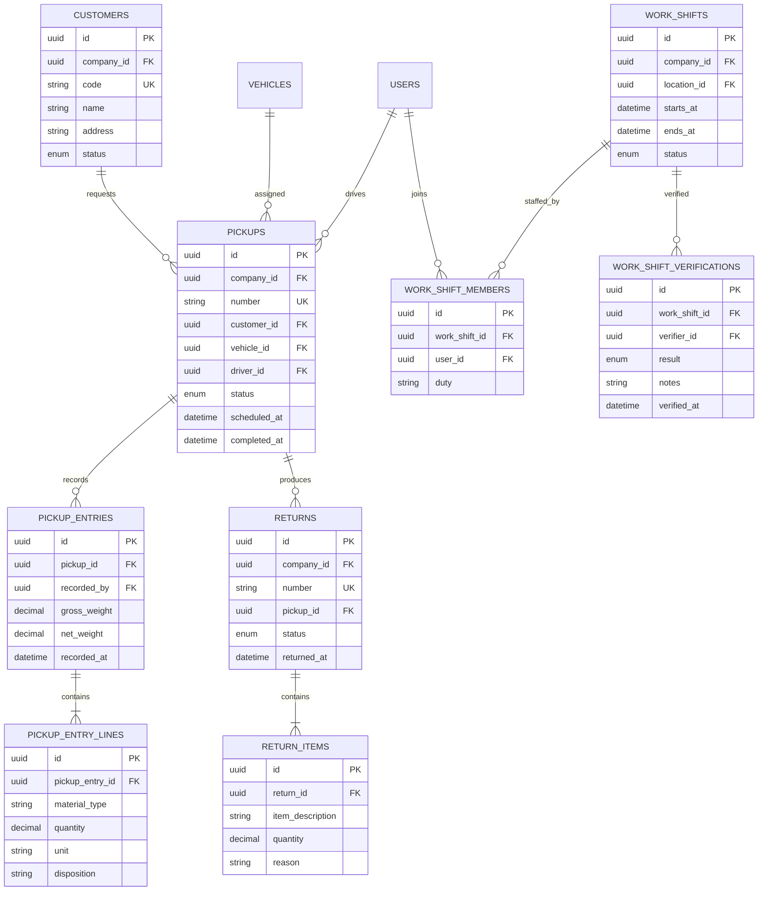

# Domain Model dan Logical ERD

Status: baseline desain untuk implementasi. Dokumen ini bukan salinan database ERP lama dan belum menggantikan migration sebagai definisi fisik schema.

## Prinsip model data

- Semua primary key menggunakan UUID/ULID dan tidak bergantung pada ID legacy.
- Tabel transaksi menyimpan status eksplisit, timestamp, dan aktor perubahan penting.
- Nilai uang disimpan sebagai decimal dan selalu memiliki currency.
- Waktu disimpan dalam UTC; tampilan mengikuti timezone lokasi atau pengguna.
- Soft delete hanya dipakai pada master data yang memang boleh dipulihkan. Transaksi finansial tidak dihapus; koreksi dilakukan melalui reversal atau adjustment.
- Referensi dokumen bisnis memakai nomor yang dibangkitkan server, bukan `MAX(id) + 1`.
- File disimpan di object storage; database hanya menyimpan metadata dan checksum.
- Integrasi asynchronous memakai outbox agar perubahan data dan event tercatat atomik.
- Seluruh aggregate bisnis memiliki `company_id`; data antar-legal-entity tidak boleh bercampur walaupun berada pada database yang sama.

## Peta bounded module

## 1. Identity, organization, dan authorization

`users` tidak memiliki kolom `role_id` atau `department_id`. Hubungan organisasi dan hak akses memiliki lifecycle sendiri.

Aturan penting:

- Company awal adalah `RKS` (PT Rajawali Kreatif Sentosa) dan `RKSINERGI` (PT Rajawali Kreatif Sinergi).
- User identity dapat dipakai lintas company, tetapi membership dan role assignment harus diberikan secara eksplisit untuk setiap company.
- Department awal per company: Retail, Delivery, Outbound, HR, GA, Finance, Operation Excellence, dan IT. Company dapat menonaktifkan department yang tidak berlaku tanpa mengubah katalog platform.
- Kode department dan location unik di dalam company, bukan global.
- Satu user boleh menjadi anggota beberapa departemen, tetapi hanya satu membership aktif yang primary.
- Role assignment selalu memiliki company scope; di dalamnya dapat dibatasi lagi berdasarkan departemen dan/atau lokasi.
- Permission menggunakan pola `module.resource.action`, misalnya `procurement.purchase-request.approve`.
- Hak efektif dihitung dari assignment yang aktif dan scope request. Tidak ada pengecekan role menggunakan ID hardcoded.
- Menonaktifkan user segera membatalkan session dan akses API, tanpa menghapus histori transaksinya.

## 2. Workflow dan approval

Workflow bersifat configurable, tetapi versi workflow yang sudah dipakai transaksi tidak boleh berubah secara retroaktif.

## 3. Procurement, inventory, dan finance

Inventory balance adalah projection dari movement, bukan sumber kebenaran kedua, dan harus dapat direkonstruksi. Weighted moving average dihitung atomik per company-item-location pada receipt/positive adjustment; issue memakai average cost sebelum movement. Negative stock tidak diizinkan. Fixed asset memiliki acquisition/depreciation lifecycle sendiri dan tidak memakai valuation stock ini.

## 4. Fleet dan maintenance

## 5. Pickup, return, dan shift operations

## 6. Shared platform records

| Entity | Fungsi |
|---|---|
| `files` | Metadata object, MIME type, size, checksum, owner, dan retention |
| `document_sequences` | Nomor dokumen atomik per tipe, lokasi, dan periode |
| `idempotency_keys` | Mencegah duplikasi command API/mobile |
| `outbox_messages` | Event reliable untuk notification dan integrasi |
| `notifications` | Inbox notification dan delivery status |
| `comments` | Percakapan polymorphic bila domain mengizinkan |
| `audit_logs` | Jejak perubahan immutable untuk operasi sensitif |

## Constraint lintas domain

- Nomor dokumen unik setidaknya per tenant/perusahaan dan tipe dokumen.
- Status berubah hanya melalui domain command yang diizinkan; endpoint update generik tidak boleh mengubah lifecycle transaksi.
- Semua foreign key transaksi menggunakan `RESTRICT`, kecuali child murni yang aman memakai cascade.
- Approval, posting pembayaran, goods receipt, inventory movement, dan perubahan status kendaraan wajib berada dalam database transaction.
- Snapshot nama/harga/alamat hanya ditambahkan bila dokumen hukum atau histori memang harus mempertahankan nilai saat transaksi dibuat.

## Keputusan lanjutan sebelum physical schema domain

- Detail material taxonomy dan unit conversion.
- Detail fixed-asset depreciation policy.
- Integrasi GPS, accounting export, bank statement, serta attendance device.

P0 legal entity, finance scope, inventory valuation, pilot, stack, dan authentication telah diselesaikan di [10-P0-DECISIONS.md](10-P0-DECISIONS.md). Pertanyaan domain berikutnya tetap dilacak di [08-OPEN-QUESTIONS.md](08-OPEN-QUESTIONS.md).
