# Strategi Selective Data Import

## Keputusan

ERP V2 menggunakan schema baru dan hanya mengimpor data yang terbukti dibutuhkan, dapat dipahami, serta dapat direkonsiliasi. Database legacy bukan baseline migration dan tidak menjadi dependency runtime setelah cutover.

Import adalah proyek data terkontrol, bukan `INSERT ... SELECT` langsung ke tabel produksi.

## Klasifikasi data

| Kategori | Kebijakan default | Contoh |
|---|---|---|
| Master aktif dan bersih | Import setelah deduplikasi | customer, supplier, vehicle, item, lokasi |
| Identity | Import identitas minimum; bangun ulang akses | user aktif, employee number, email |
| Transaksi terbuka | Import bila owner dan status dapat diverifikasi | PO belum selesai, payment outstanding, work order aktif |
| Opening balance | Import sebagai dokumen pembuka terkontrol | stock opening, payable opening |
| Histori terbaru | Import selektif sesuai kebutuhan operasional/audit | service history kendaraan, dokumen belum kedaluwarsa |
| Histori lama/read-only | Simpan di archive/reporting store | transaksi selesai bertahun-tahun lalu |
| Data ambigu/duplikat | Karantina, jangan masuk produksi | user ganda, supplier tanpa identifier, status tak dikenal |
| Credential/session | Jangan import | password hash, remember token, session, API token |
| Konfigurasi akses legacy | Jangan import otomatis | role ID, menu access, hardcoded privilege |

## Prinsip khusus user, role, dan department

- Import user hanya untuk orang yang masih aktif dan memiliki owner bisnis.
- Email, employee number, dan nama dinormalisasi serta diperiksa duplikasinya.
- Password tidak dimigrasikan. User menerima activation flow baru.
- Department legacy dipetakan ke struktur target yang sudah disetujui, bukan disalin apa adanya.
- Role dan permission legacy hanya menjadi bahan analisis. Assignment target dibangun dari access matrix yang disetujui owner.
- Akun service/integration diinventarisasi terpisah dan secret dibuat ulang.
- User nonaktif tetap dapat masuk archive mapping agar histori lama dapat ditampilkan dengan nama yang benar tanpa memberinya akun aktif.

## Arsitektur pipeline

```mermaid
flowchart LR
    L["Legacy snapshot read-only"] --> X["Extract"]
    X --> S["Raw staging"]
    S --> P["Profile & classify"]
    P --> C["Clean, normalize, deduplicate"]
    C --> M["Map legacy ID to V2 ID"]
    M --> V["Validate business rules"]
    V --> D["Dry-run import"]
    D --> R["Reconcile & sign-off"]
    R --> I["Production import"]
    I --> A["Post-import audit"]
```

Pipeline wajib repeatable dan idempotent. Setiap run memiliki ID, versi mapping, checksum input, jumlah record, error file, dan hasil rekonsiliasi.

## Layer staging

Import tidak menulis langsung dari koneksi legacy ke domain table. Gunakan tiga lapisan:

1. `raw_*`: snapshot source tanpa perubahan untuk traceability.
2. `normalized_*`: data bersih dengan status valid/invalid dan alasan penolakan.
3. domain command/import service: menerapkan constraint yang sama dengan aplikasi.

Mapping ID disimpan eksplisit:

| source_system | entity_type | legacy_id | v2_id | import_run_id | status |
|---|---|---|---|---|---|
| `legacy_erp` | `vehicle` | `123` | `<uuid>` | `<run>` | `imported` |

Mapping mencegah ketergantungan pada kesamaan numeric ID dan membantu link archive-to-V2.

## Urutan import yang direkomendasikan

1. Legal entity, locations, dan department target.
2. User identity minimum, tanpa role.
3. Customer, supplier, item/category, vehicle/type, serta payment account.
4. File/dokumen yang masih relevan, lengkap dengan checksum.
5. Opening inventory dan opening financial positions yang sudah ditandatangani owner.
6. Transaksi terbuka berdasarkan dependency order.
7. Role assignments yang berasal dari access matrix baru.
8. Histori terpilih yang benar-benar diperlukan di V2.

Setiap source record bisnis wajib dipetakan ke `RKS` atau `RKSINERGI`. Record dengan legal entity ambigu masuk quarantine dan tidak boleh memakai company default secara diam-diam. Opening stock serta outstanding payable direkonsiliasi terpisah per company.

## Data contract per entity

Setiap entity yang diimpor wajib memiliki lembar kontrak berisi:

- owner bisnis dan owner teknis;
- alasan import;
- source table/column;
- target field dan transformasi;
- natural key/deduplication key;
- data quality rules;
- dependency;
- expected count dan monetary/control totals;
- rejection handling;
- sign-off party.

Import script tidak dibuat sebelum contract disetujui.

## Rekonsiliasi

Record count saja tidak cukup. Minimum control:

| Domain | Control total |
|---|---|
| User | user aktif per department dan daftar akun tanpa owner |
| Supplier/customer | jumlah aktif, duplikat tax/contact key, missing required data |
| Inventory | quantity per item-location serta nilai opening jika digunakan |
| Payable/payment | outstanding per supplier, currency, dan due bucket |
| Fleet | kendaraan per status/lokasi, odometer terakhir, dokumen aktif |
| Maintenance | open work order dan service due schedule |
| File | jumlah, total byte, checksum match, dan object yang hilang |

Perbedaan harus memiliki explanation dan persetujuan tertulis. Toleransi nilai uang default adalah nol kecuali owner finance menetapkan aturan pembulatan.

## Cutover

### Sebelum cutover

- Bekukan perubahan structural pada source.
- Jalankan minimal dua dress rehearsal menggunakan snapshot production-like.
- Selesaikan reconciliation dan UAT untuk transaksi terbuka.
- Buat daftar siapa yang boleh memutuskan go/no-go.
- Uji backup, restore, rollback aplikasi, dan pembatalan import.

### Window cutover

1. Legacy masuk read-only untuk module yang dipindahkan.
2. Ambil final snapshot dan checksum.
3. Jalankan delta extraction bila disiapkan.
4. Import, validate, dan reconcile.
5. Aktifkan user serta route traffic.
6. Pantau error, queue, audit, dan control total.

Rollback berarti mengembalikan traffic ke sistem lama dan membuang database V2 hasil run yang gagal dari environment cutover—bukan mencoba memperbaiki sebagian data secara manual di tempat.

## Archive legacy

Setelah cutover, legacy idealnya menjadi read-only archive pada akses internal terbatas. Archive bukan bagian dari flow transaksi baru dan tidak boleh dipanggil synchronously oleh API V2.

Jika regulator atau operasional membutuhkan histori di UI V2, gunakan salah satu:

- reporting store terpisah yang dibangun dari snapshot legacy; atau
- deep link read-only ke archive dengan mapping ID.

`olderp.domain.com` dapat dipakai sementara untuk archive, tetapi bukan jalur utama pengguna dan memiliki tanggal penghentian yang jelas.

## Exit criteria import

- Semua entity import memiliki contract dan sign-off.
- Tidak ada password, token, atau permission legacy yang terbawa.
- Semua record rejected memiliki owner dan disposition.
- Control total cocok atau memiliki variance approval.
- Import dapat diulang dari database V2 kosong dengan hasil sama.
- Production import log, mapping, dan evidence tersimpan sesuai retention policy.
