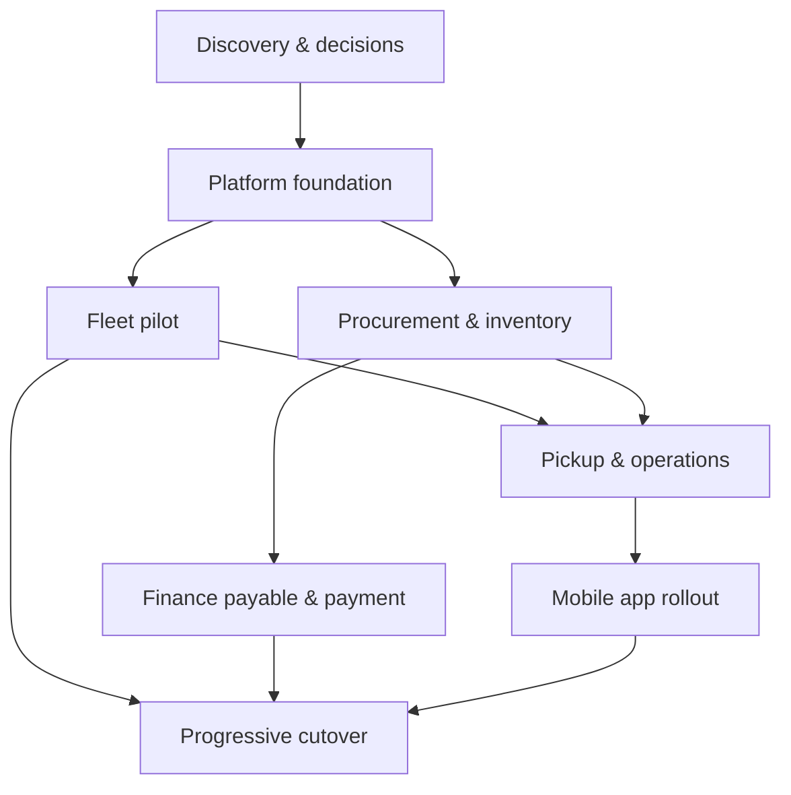

# Delivery Plan ERP V2

## Strategi delivery

ERP V2 dibangun sebagai produk baru dalam irisan vertikal kecil. Setiap irisan harus mencakup API, authorization, UI, audit, observability, test, dan—bila diperlukan—import. Kita tidak menunggu seluruh module selesai untuk mendapatkan feedback, tetapi juga tidak melakukan big-bang rewrite tanpa quality gate.

Durasi di bawah adalah kisaran untuk perencanaan awal, bukan komitmen sebelum kapasitas tim dan scope bisnis dikonfirmasi.

## Stage 0 — Discovery dan keputusan bisnis (2–4 minggu)

Deliverable:

- process mapping as-is dan to-be untuk flow prioritas;
- data profiling database legacy;
- organization/departments target dan access matrix;
- keputusan legal entity, finance scope, inventory valuation, dan retention;
- daftar transaksi terbuka serta kandidat selective import;
- baseline SLA, volume, concurrency, serta target cutover.

Exit gate:

- owner per domain ditetapkan;
- pertanyaan P0 pada [08-OPEN-QUESTIONS.md](08-OPEN-QUESTIONS.md) terjawab;
- PRD, ERD, dan access model disetujui untuk foundation;
- prioritas pilot module disepakati.

## Stage 1 — Platform foundation (3–5 minggu)

Deliverable:

- repository dan CI/CD;
- local/dev/staging environment;
- API skeleton dan module boundaries;
- identity, department, location, RBAC scoped, session/token, serta MFA foundation;
- audit log, file metadata, idempotency, document sequence, outbox, notification foundation;
- frontend shell ERP dan OPS;
- API contract generation serta client SDK baseline;
- logging, metrics, tracing, error reporting, backup, dan restore test.

Exit gate:

- user lifecycle dan access matrix lulus security test;
- deployment repeatable dari clean environment;
- privileged action memiliki audit trail;
- observability dan rollback diuji.

## Stage 2 — Pilot vertical slice (4–7 minggu)

Pilot yang disetujui: fleet master + daily checklist + maintenance work order pada PT Rajawali Kreatif Sentosa/Warehouse Kresek. Scope ini menyentuh ERP, OPS/mobile-ready API, file, audit, role scope, dan workflow tanpa terlebih dahulu mengambil risiko posting finance. Lokasi boleh diganti sebelum onboarding pilot bila discovery menunjukkan ownership fleet berbeda; perubahan itu tidak mengubah schema atau architecture.

Deliverable:

- vehicle/type/document/status;
- checklist template versioning dan submission;
- service schedule dan work order;
- selective import vehicle aktif serta histori service relevan;
- responsive OPS UI yang dapat dipakai perangkat mobile;
- operational dashboard minimum.

Exit gate:

- satu lokasi pilot menjalankan flow end-to-end;
- tidak ada critical security/data integrity issue;
- reconciliation kendaraan dan work order ditandatangani;
- support/runbook tersedia.

## Stage 3 — Procurement dan inventory (6–10 minggu)

Deliverable:

- item, supplier, inventory location;
- purchase request, approval, purchase order;
- goods receipt, movement ledger, stock count/adjustment;
- attachment dan approval threshold;
- opening stock serta transaksi procurement terbuka terpilih.

Exit gate:

- request-to-receipt berhasil end-to-end;
- self-approval terblokir;
- stock ledger dapat direkonstruksi dan direkonsiliasi;
- negative/invalid stock policy teruji.

## Stage 4 — Finance payable dan payment (6–10 minggu)

Deliverable:

- payable/payment schedule;
- maker-checker-approver flow;
- payment posting, allocation, adjustment/reversal;
- reconciliation dan financial audit report;
- opening outstanding balance serta transaksi terbuka terpilih.

Exit gate:

- segregation of duties teruji;
- nilai dan currency direkonsiliasi tanpa unexplained variance;
- reversal tidak menghapus histori;
- finance owner memberikan sign-off.

General ledger penuh tidak termasuk baseline V2. Jika kemudian dibutuhkan, ia menjadi product stage dan ADR tersendiri atau dilakukan melalui integration ke accounting system.

## Stage 5 — Pickup, operations, dan mobile app (6–12 minggu)

Deliverable:

- scheduling/dispatch, trip, pickup entry, pending/return;
- shift dan verification;
- mobile authentication, device session, offline command queue, retry/idempotency;
- proof/file upload yang tahan koneksi tidak stabil;
- push notification bila dibutuhkan.

Exit gate:

- replay offline tidak menghasilkan transaksi ganda;
- flow lapangan lulus uji pada perangkat dan jaringan nyata;
- dispatch serta completion dapat ditelusuri penuh;
- API yang sama dipakai ERP, OPS web, dan mobile tanpa bypass policy.

## Stage 6 — Cutover bertahap dan retirement

Deliverable:

- dress rehearsal, final import, reconciliation, dan cutover runbook;
- module-by-module read-only switch pada legacy;
- hypercare dashboard dan incident rota;
- archive policy, access restriction, dan retirement milestones.

Exit gate:

- seluruh in-scope process berjalan di V2;
- legacy tidak lagi menerima transaksi untuk module yang selesai;
- archive memenuhi kebutuhan audit;
- tanggal shutdown atau decommission disetujui.

## Dependency dan urutan

Parallel work hanya aman setelah foundation contract stabil. UI dapat berjalan paralel dengan backend menggunakan OpenAPI mock, sedangkan import profiling dapat dimulai sejak discovery.

## Backlog implementasi pertama

### Epic A — Repository dan environments

- Putuskan stack dan version policy.
- Buat monorepo/workspace untuk API, ERP web, dan OPS web.
- Tambahkan formatter, linter, static analysis, unit/integration test, secret scan, dependency scan.
- Buat local development dengan database, queue, mail catcher, dan object storage emulator.
- Buat deployment staging serta migration job terpisah.

### Epic B — Identity foundation

- Schema user, department hierarchy, location, membership, role, permission, assignment.
- Invite, activate, login, refresh/logout, reset password, revoke sessions.
- Authorization service dengan department/location scope.
- Admin UI untuk membership dan assignment yang tidak memungkinkan privilege escalation.
- Audit dan test matrix.

### Epic C — Shared platform

- Request/correlation ID dan structured error response.
- File upload/finalize/scan flow.
- Document sequence atomik.
- Idempotency middleware.
- Outbox publisher dan notification worker.
- Approval workflow v1.

### Epic D — Import discovery

- Snapshot source read-only.
- Data profiling user/department/role dan fleet.
- Mapping workbook/data contract.
- Dry-run pipeline pertama untuk vehicle master.

## Team minimum yang realistis

- product owner dengan kewenangan keputusan bisnis;
- business analyst/domain analyst;
- technical lead/architect;
- backend engineers;
- frontend engineer untuk ERP/OPS;
- QA automation;
- DevOps/platform support;
- data migration engineer saat import/cutover;
- perwakilan security serta domain owner paruh waktu.

Mobile engineer ditambahkan sebelum Stage 5; API dan responsive OPS UI disiapkan sejak foundation.

## Quality gates setiap increment

- Acceptance criteria dan threat cases disepakati sebelum coding.
- Schema hanya berubah melalui versioned migration.
- API contract dan authorization test lulus.
- Observability tersedia sebelum release.
- Data migration memiliki dry-run dan reconciliation evidence.
- Product/domain owner menerima demo dengan data representatif.
- Rollback atau forward-fix procedure terdokumentasi.
- Definition of Done pada [07-ENGINEERING-STANDARDS.md](07-ENGINEERING-STANDARDS.md) terpenuhi.

## Risiko utama dan mitigasi

| Risiko | Dampak | Mitigasi |
|---|---|---|
| Scope terus melebar | V2 tidak pernah selesai | Slice per outcome, change control, non-goals jelas |
| Aturan bisnis hanya ada di kepala user | Flow salah | Workshop, example mapping, approval owner |
| Data legacy ambigu | Import tidak dapat dipercaya | Profiling awal, quarantine, selective import, reconciliation |
| Menyalin desain akses lama | Privilege escalation berulang | Access matrix baru, scoped RBAC, SoD test |
| Big-bang cutover | Downtime/rollback sulit | Progressive module cutover dan dress rehearsal |
| Modular monolith menjadi spaghetti baru | Biaya perubahan naik | Dependency rules, module contract, architecture test |
| Mobile dibuat sebagai API khusus kedua | Logic dan security berbeda | Contract API yang sama, idempotency, device/offline design |

## Pelaporan program

Setiap minggu laporkan outcome, bukan hanya jumlah task:

- flow yang sudah dapat dijalankan end-to-end;
- decision/blocker yang menunggu owner;
- defect severity dan trend;
- import rejection dan reconciliation variance;
- deployment health;
- risiko scope, security, dan cutover.
