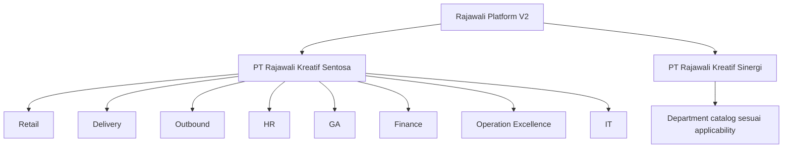

# P0 Decisions Baseline

Status: Accepted

Decision date: 2026-07-22

Seluruh keputusan P0 yang mengubah architecture atau logical data model telah diselesaikan. Detail bisnis P1/P2 tetap harus ditutup sebelum module terkait dibangun atau dirilis.

## Decision summary

| ID | Keputusan final | Dampak utama |
|---|---|---|
| Q-001 | Shared multi-company platform untuk PT Rajawali Kreatif Sentosa dan PT Rajawali Kreatif Sinergi | `company_id` wajib, numbering/account/balance/approval terisolasi |
| Q-002 | Department: Retail, Delivery, Outbound, HR, GA, Finance, Operation Excellence, IT | Department dimiliki company; location/area bukan department |
| Q-003 | Finance fase awal: AP, operational expense, petty cash, payment/allocation/reconciliation; tanpa GL penuh | Tidak membuat COA/journal/trial balance palsu; siapkan accounting export contract |
| Q-004 | Weighted moving average per company-item-location; negative stock dilarang | Movement menyimpan cost/value; balance projection atomik; asset terpisah |
| Q-005 | Fleet + Maintenance sebagai pilot; RKS/Warehouse Kresek menjadi planning default | Irisan pertama menguji API, RBAC, audit, file, import, dan mobile-ready OPS UI |
| Q-006 | Laravel 13/PHP 8.5, PostgreSQL 18, Redis, React 19/TypeScript/Vite, Flutter 3.44, private S3, OpenAPI 3.1 | Repository scaffold dan CI mengikuti baseline ini |
| Q-007 | Local identity untuk fase awal, OIDC-ready, MFA privileged/finance | Credential legacy tidak diimpor; V2 mengelola lifecycle dan session |

## Organization baseline

Department catalog dapat dipakai kedua company, tetapi membership dan activation tetap per company. Location, warehouse, operational area, service point, route, dan customer tidak boleh dimasukkan ke hierarchy department.

## Pilot boundary

Pilot mencakup:

- vehicle/type/status master;
- document dan expiry;
- daily checklist serta odometer;
- service schedule;
- maintenance work order, job, part usage, cost, dan completion;
- selective import vehicle aktif serta histori service yang relevan;
- dashboard availability/exception minimum.

Pilot tidak mencakup pickup, full mobile native app, GPS integration, procurement penuh, payment posting, atau seluruh histori fleet. Location default boleh dikoreksi sebelum onboarding bila fleet ownership mapping menunjukkan lokasi lain.

## Change control

Perubahan terhadap salah satu keputusan ini harus memperbarui dokumen terdampak dan membuat ADR baru/superseding ADR bila mengubah architecture, isolation, valuation, atau technology baseline.
