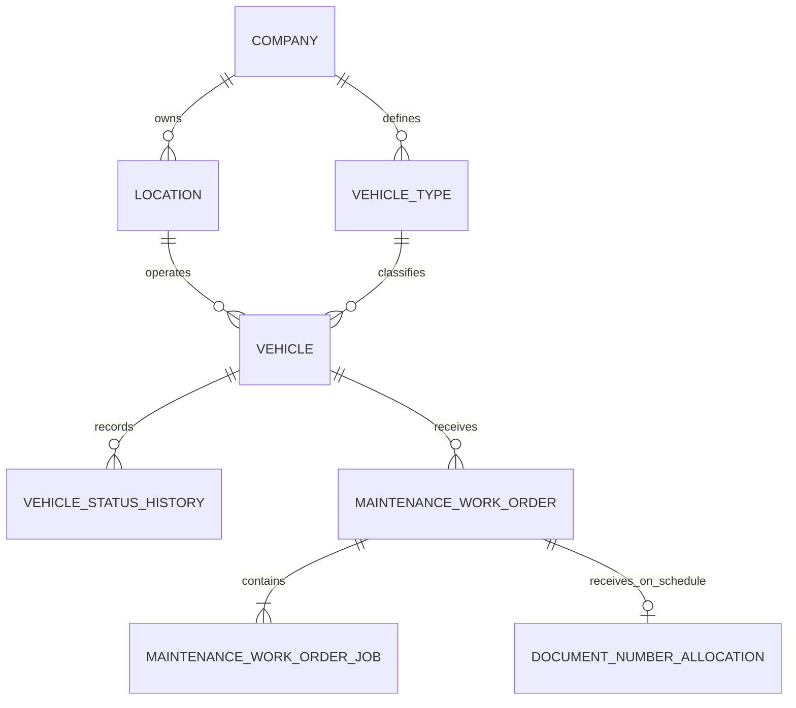

# Fleet + Maintenance Pilot Implementation

Status date: 2026-07-23

Dokumen ini mencatat vertical slice pertama untuk pilot RKS / Warehouse Kresek: vehicle master, status history, dan maintenance work order. Trip/checklist/odometer telah dilanjutkan pada [15-DAILY-VEHICLE-OPERATIONS.md](15-DAILY-VEHICLE-OPERATIONS.md). Fuel, document renewal, part inventory, vendor billing, serta service schedule belum masuk increment ini.

## Bukti legacy yang dipakai

Profil source dilakukan terhadap migration, model, controller, dump, dan dokumen Fleet legacy. Temuan yang memengaruhi desain:

- satu kendaraan direpresentasikan oleh tiga model PHP berbeda;
- availability tersebar pada `is_active`, `is_available`, `is_service`, `is_pickup`, `is_vendor`, dan `operational_status` sehingga kombinasi dapat saling bertentangan;
- expiry dokumen tersimpan sebagai string dan mengandung format campuran, nilai `Invalid date`, serta tanggal kosong;
- brand, model, vendor, dan tipe mengandung variasi kapitalisasi, typo, placeholder, serta nilai yang tertukar;
- status service session adalah `scheduled`, `in_progress`, `completed`, `cancelled`, sedangkan status item memiliki state sendiri tanpa policy transisi eksplisit;
- status service schedule dihitung sekaligus ditulis ketika halaman daftar dibuka;
- approval biaya memakai threshold hardcoded dan belum memiliki approval instance yang dapat diaudit;
- stock part langsung dikurangi di controller service, sehingga maintenance dan inventory tidak memiliki boundary transaksi yang jelas.

Konsekuensinya, source hanya menjadi kandidat import. Tidak ada enum, flag, tanggal, approval, atau total biaya legacy yang dipercaya tanpa normalisasi dan rekonsiliasi.

## Physical slice



Seluruh ID menggunakan ULID. Natural key `vehicle.code` dan `plate_number` unik per legal entity; lokasi tetap menjadi scope authorization dan operasi. Mutation berjalan dalam transaksi, dicatat pada audit log, dan endpoint mutation dilindungi idempotency middleware.

## Lifecycle yang diimplementasikan

Vehicle memakai satu `operational_status` kanonik:

```text
available -> in_use | maintenance | blocked | inactive
in_use -> available | maintenance | blocked
maintenance -> available | blocked | inactive
blocked -> available | maintenance | inactive
inactive -> available
```

Setiap perubahan membutuhkan alasan dan menghasilkan `vehicle_status_histories`. Kendaraan tidak dapat dibuat `available` secara manual selama work order masih `in_progress`.

Work order:

```text
draft -> scheduled -> in_progress -> completed
  |          |             |
  +----------+-------------+-> cancelled
```

- Draft belum mempunyai nomor resmi.
- Transisi ke `scheduled` mengalokasikan nomor secara atomik memakai rule efektif perusahaan/lokasi.
- Transisi ke `in_progress` mengubah kendaraan menjadi `maintenance` dan menolak kendaraan `in_use`/`inactive` atau work order aktif kedua.
- `completed` dan pembatalan work order yang sedang dikerjakan mengembalikan kendaraan ke `available` serta menulis status history.
- Job line mengikuti status header pada slice awal. Partial completion dan independent job transition ditunda sampai workshop proses maintenance.

## Nomor work order pilot

Seeder pilot menerbitkan rule version 1 untuk RKS / Warehouse Kresek:

```text
WO/{COMPANY}/{LOCATION}/{YYYY}/{MM}/{SEQ}
padding: 5
reset: monthly
timezone: Asia/Jakarta
```

Rule adalah effective-dated dan menjadi immutable setelah alokasi pertama. Q-207 tetap membutuhkan sign-off owner; bila format final berubah, publish version baru—nomor historis tidak ditulis ulang.

## Authorization

- `fleet.vehicle.view` dan `fleet.vehicle.manage` dievaluasi sampai `location_id`.
- `maintenance.work-order.view` dan `maintenance.work-order.manage` dievaluasi sampai `location_id`.
- Operations context hanya mengembalikan lokasi aktif yang benar-benar dapat diakses identity.
- Cross-company/cross-location route tidak dapat dipakai untuk membaca resource.

## Selective import contract: vehicle master

| Target | Source candidate | Transform/validation |
|---|---|---|
| `company_id` | `vendor_kendaraan`, ownership evidence, owner mapping | wajib mapping eksplisit ke RKS/RKSINERGI; ambiguous -> quarantine |
| `location_id` | operational assignment | tidak tersedia andal di vehicle legacy; wajib enrichment owner |
| `vehicle_type_id` | `type_vehicles_id`, model | normalize/deduplicate type catalog sebelum vehicle |
| `code` | generated target code | tidak mengambil numeric legacy ID |
| `plate_number` | `nomor_plat` | uppercase, whitespace normalization, reject placeholder/test, unique per company |
| `brand`, `model` | `brand_kendaraan`, `model_kendaraan` | canonical mapping; swapped/typo values masuk review |
| `model_year` | `tahun` | integer 1900..current+1; placeholder/invalid -> null + issue |
| `ownership_type`, `provider_name` | `is_vendor`, `vendor_kendaraan` | owner-confirmed mapping; jangan simpulkan legal entity dari vendor saja |
| `current_odometer` | `last_oddo` plus latest evidence | non-negative; reconcile dengan latest trusted odometer event |
| `operational_status` | multiple legacy flags | active vehicle default candidate `available`; blocked/import exceptions require owner review |
| `legacy_source_id` | `vehicles.id` | traceability only, never used as target key |

Import hanya mengambil kendaraan aktif yang disetujui Fleet owner. Initial target status dan odometer harus direkonsiliasi per lokasi. Dokumen expiry, checklist, service history, dan open work order memiliki contract terpisah sebelum diimpor.

## Acceptance evidence

- clean SQLite migration dan test lifecycle/location isolation;
- work-order number allocation rollback-safe dan tidak dialokasikan pada draft;
- API contract versioned untuk Operations Web/mobile consumer;
- Mantine Operations Web dapat login, menemukan site berdasarkan access scope, membuat vehicle/type/work order, dan menjalankan lifecycle;
- PostgreSQL 18 migration/seeder dan container execution telah diverifikasi melalui local Compose.

## Keputusan yang masih membutuhkan owner

- final status labels/transitions dan siapa yang boleh override (`Q-131`);
- service due basis, tolerance, dan escalation (`Q-132`);
- mandatory vehicle document and blocking policy (`Q-133`);
- cost approval threshold/matrix serta integrasi procurement/inventory;
- final numbering sign-off (`Q-207`);
- disposition tiap record pada vehicle import dry-run.
