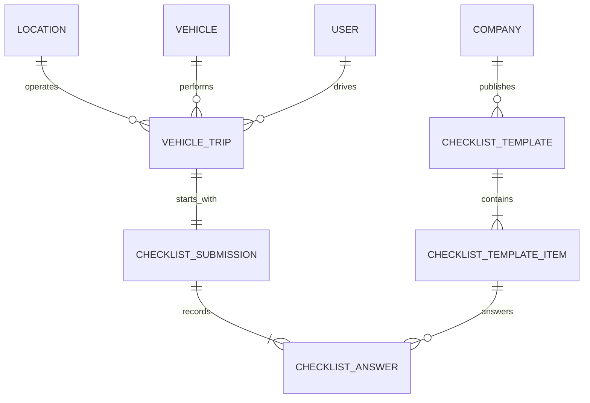

# Daily Vehicle Operations

Status date: 2026-07-23

Dokumen ini menetapkan vertical slice kedua pilot Fleet: checklist sebelum berangkat, checkout kendaraan, trip aktif, odometer masuk, check-in, dan pembatalan terkendali. Kontrak yang sama dipakai Operations Web sekarang dan mobile app nanti; ERP dapat membaca data yang sama melalui API tanpa database atau business rule terpisah.

## Scope dan aktor

- `ops-driver` adalah role lokasi untuk melihat kendaraan, mengambil checklist aktif, melihat trip miliknya, checkout, dan check-in.
- `fleet-manager` melihat seluruh trip lokasi, dapat menjalankan operasi pilot, dan dapat membatalkan trip aktif dengan alasan.
- Driver checkout sebagai identity yang sedang login. Dispatch kendaraan kepada identity lain sengaja belum dibuka agar assignment tidak dapat dipalsukan oleh client.
- Checklist evidence file bersifat opsional sampai owner menetapkan policy wajib. Fuel event, pickup/delivery event, route planning, dan offline synchronization belum menjadi bagian increment ini.

## Model fisik



Template mempunyai `code`, version, dan status `draft | active | retired`. Trip menyimpan template/submission yang dipakai sehingga perubahan checklist berikutnya tidak mengubah bukti historis. Pilot men-seed `VEHICLE_PRE_DEPARTURE` version 1 untuk RKS dengan enam pemeriksaan: body, lampu depan, lampu belakang/rem, ban, ban cadangan/peralatan, serta kaca/spion/wiper.

## Lifecycle dan invariant

```text
available vehicle
    -> checkout + complete checklist
    -> active trip / vehicle in_use
    -> check-in
    -> completed trip / vehicle available

active trip
    -> manager cancellation
    -> cancelled trip / vehicle available
```

Semua mutation berada dalam satu transaksi database dan menulis audit serta vehicle status history.

- Hanya kendaraan `available` yang dapat di-checkout.
- Satu kendaraan hanya dapat mempunyai satu trip aktif.
- Satu driver hanya dapat mempunyai satu trip aktif.
- `start_odometer >= vehicle.current_odometer`; checkout memperbarui odometer kendaraan ke nilai awal yang telah diverifikasi driver.
- Semua item required harus dijawab. Item kritis harus `pass`; `fail` atau `not_applicable` memblokir checkout.
- `end_odometer >= start_odometer` dan tidak boleh lebih kecil daripada current vehicle odometer.
- Waktu check-in tidak boleh lebih awal daripada waktu checkout.
- Check-in oleh non-manager hanya dapat dilakukan driver yang ditugaskan pada trip.
- Trip completed/cancelled melepaskan unique active keys agar kendaraan dan driver dapat dipakai lagi tanpa menghapus histori.

## API surface

| Method | Route | Permission | Tujuan |
|---|---|---|---|
| GET | `/companies/{company}/locations/{location}/fleet/checklist-template` | `fleet.trip.view` | Template aktif dan ordered items |
| GET | `/companies/{company}/locations/{location}/fleet/trips` | `fleet.trip.view` | Manager melihat lokasi; driver hanya histori sendiri |
| POST | `/companies/{company}/locations/{location}/fleet/trips/checkout` | `fleet.trip.operate` | Checklist + trip + vehicle state atomik |
| GET | `/companies/{company}/locations/{location}/fleet/trips/{trip}` | `fleet.trip.view` | Detail trip dan bukti checklist |
| POST | `/companies/{company}/locations/{location}/fleet/trips/{trip}/check-in` | `fleet.trip.operate` | Tutup trip dan majukan odometer |
| POST | `/companies/{company}/locations/{location}/fleet/trips/{trip}/cancel` | `fleet.trip.manage` | Pembatalan dengan alasan |

Mutation tetap dilindungi request correlation dan idempotency middleware. Resource company/location divalidasi ulang di controller/service, bukan hanya mengandalkan ULID dari client.

## Evidence checklist

Setiap jawaban dapat membawa maksimum tiga `evidence_file_ids`. Binary harus lebih dahulu melewati private-file initiate/upload/finalize flow. Checkout hanya menerima file yang:

- berada pada legal entity yang sama;
- diunggah oleh driver yang melakukan checkout;
- memakai purpose `checklist_evidence`;
- berstatus `ready` setelah malware scan;
- belum attached ke domain record lain.

Attachment file ke checklist answer, pembuatan trip, dan perubahan status kendaraan terjadi dalam transaksi yang sama. File yang sudah ready tetapi tidak pernah attached akan di-expire setelah reservation window agar retry/upload yang ditinggalkan tidak menjadi orphan permanen. Response trip hanya menampilkan metadata evidence aman dan tidak pernah mengekspos disk atau object-storage key.

## Mobile readiness

Payload tidak bergantung pada HTML atau session browser. Mobile login/refresh-token family yang sudah ada dapat memanggil endpoint yang sama dengan bearer token. Langkah mobile berikutnya adalah secure storage, local draft checklist, upload evidence, dan idempotent retry queue. Offline checkout final belum boleh dilakukan sebelum policy konflik waktu, odometer, dan vehicle availability ditetapkan; draft offline boleh disiapkan, tetapi server tetap menjadi authority saat submit.

## Acceptance evidence

- SQLite feature tests mencakup lifecycle sukses, required/critical checklist, odometer regression, active driver conflict, cancellation, audit, dan pelepasan active keys.
- PostgreSQL 18 menjalankan clean migration + seeder dan seluruh API suite: 126 test, 774 assertion, PHP 8.5.
- Operations Web Mantine mempunyai tab operasional harian, upload evidence yang menunggu hasil scan, checklist checkout, check-in, dan manager cancellation.
- OpenAPI `0.17.0` mendeskripsikan enam endpoint, schema trip/checklist, dan evidence attachment.

## Deferred owner decisions

- apakah item non-kritis `fail` boleh berangkat dengan acknowledgement supervisor;
- item checklist final per tipe kendaraan dan version-publishing workflow;
- kapan evidence foto menjadi wajib per item/exception (dukungan attachment opsional sudah tersedia);
- dispatch driver oleh Fleet/Delivery coordinator;
- tolerance timestamp dan kebijakan offline conflict pada mobile;
- kapan fuel, pickup/delivery, route, dan geolocation menjadi event di dalam trip.
